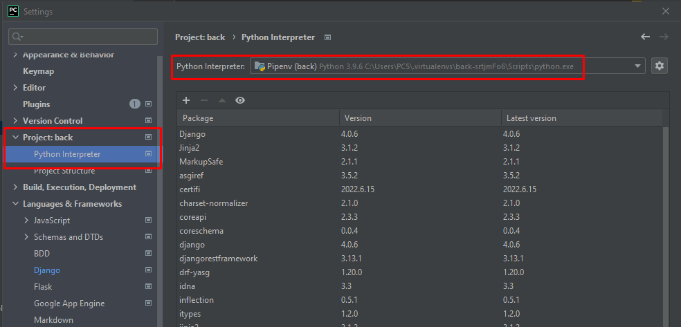
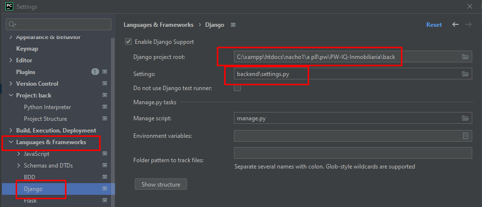

# Django

Installar Pipenv:
`pip install pipenv==2018.11.26`
Generar pipfile para administrar los paquetes del entorno de desarrollo:
`pipenv shell`
Dentro de Pipfile se puede agregar los paquetes que se quieran utilizar:
`[packages]`
instalar los paquetes:
`pipenv install`


##### Django
`pipenv install django`
##### Django Rest Framework
`pipenv install djangorestframework`
##### Swagger UI
`pipenv install drf-yasg`
### SimpleJWT:
`pipenv install djangorestframework-simplejwt`


#### Crear proyecto Django:
`django-admin startproject back .`

#### Generar el modulo de la aplicacion:
`django-admin startapp api`

Agregar api al proyecto (backend/settings.py):
```
INSTALLED_APPS = [
    ...
    'rest_framework',
    'drf-yasg',
    'rest_framework_simplejwt',
    'api',
    ...
]
```
Agregar JWT al proyecto (backend/settings.py):
```
REST_FRAMEWORK = {
    ...
    'DEFAULT_AUTHENTICATION_CLASSES': (
        ...
        'rest_framework_simplejwt.authentication.JWTAuthentication',
    )
    ...
}
```


## Correr proyecto Django:
`python manage.py runserver`

### Ejecutar migrations:
`python manage.py migrate`

### Crear migraciones:
`python manage.py makemigrations`
Generar la aplicacion de migraciones despues de los cambios en models.py


### Crear archivo de configuracion:
`python manage.py createsuperuser`


#### querys correspondiente a sqlmigrate:
`python manage.py sqlmigrate api 0001`
Son las modificaciones en las tablas en SQL.


models.py     


``
``
``
``
``
``


---
### SETEINGS PyCharm:
---

